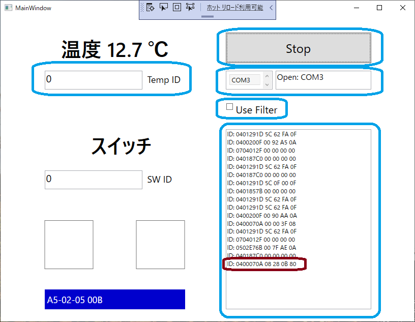
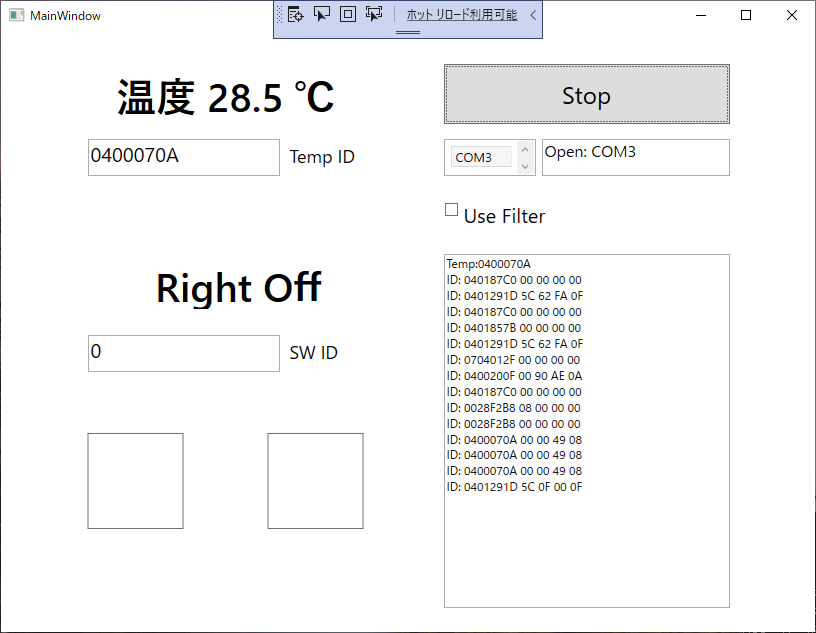
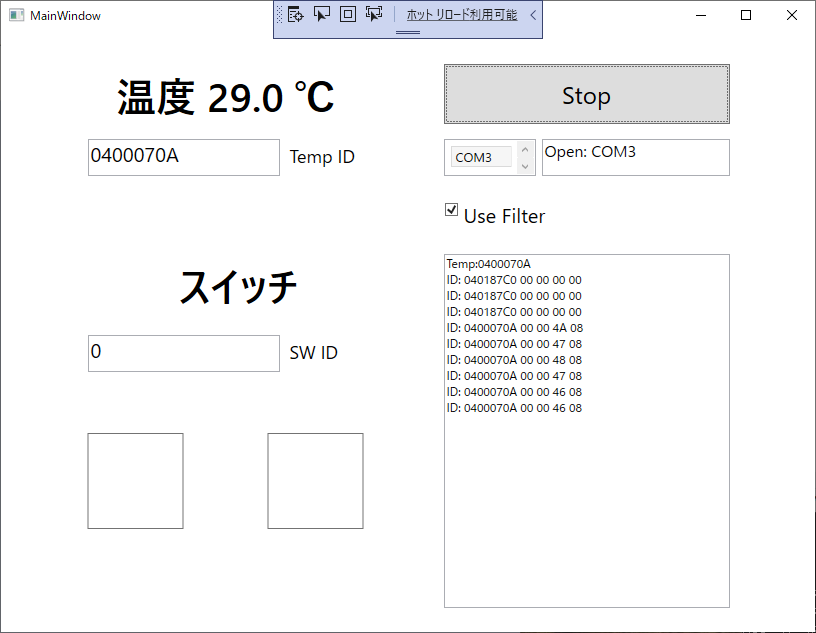
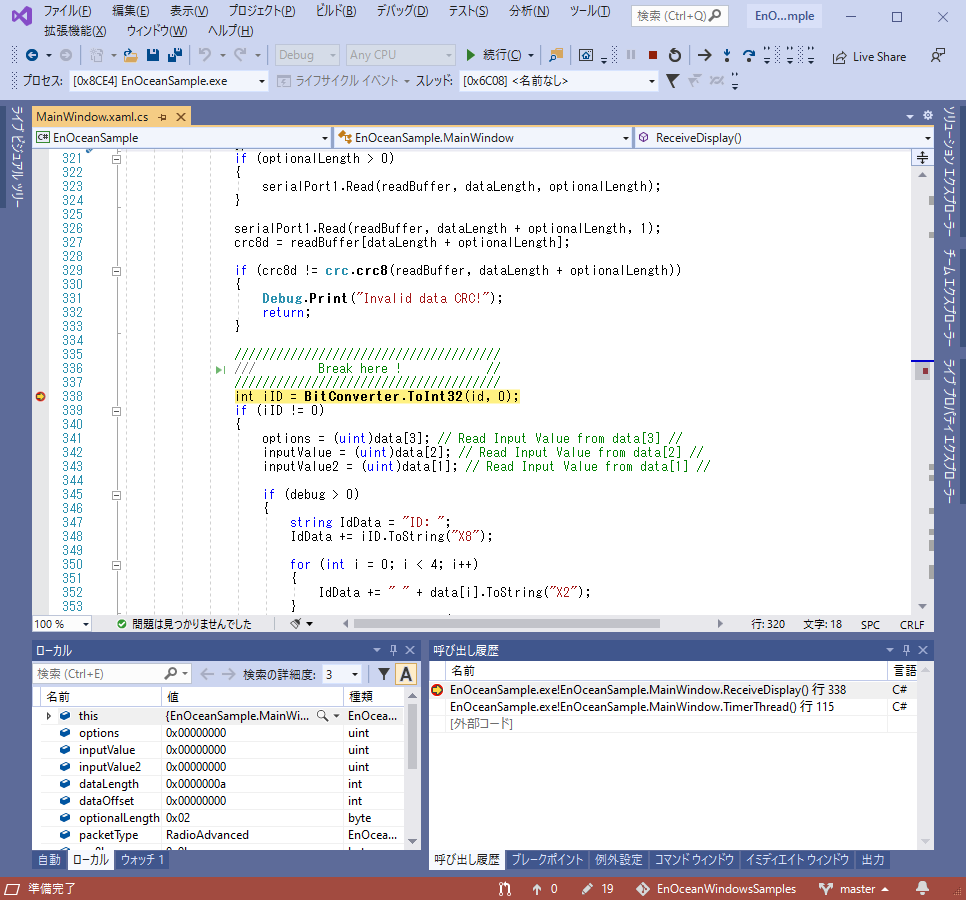
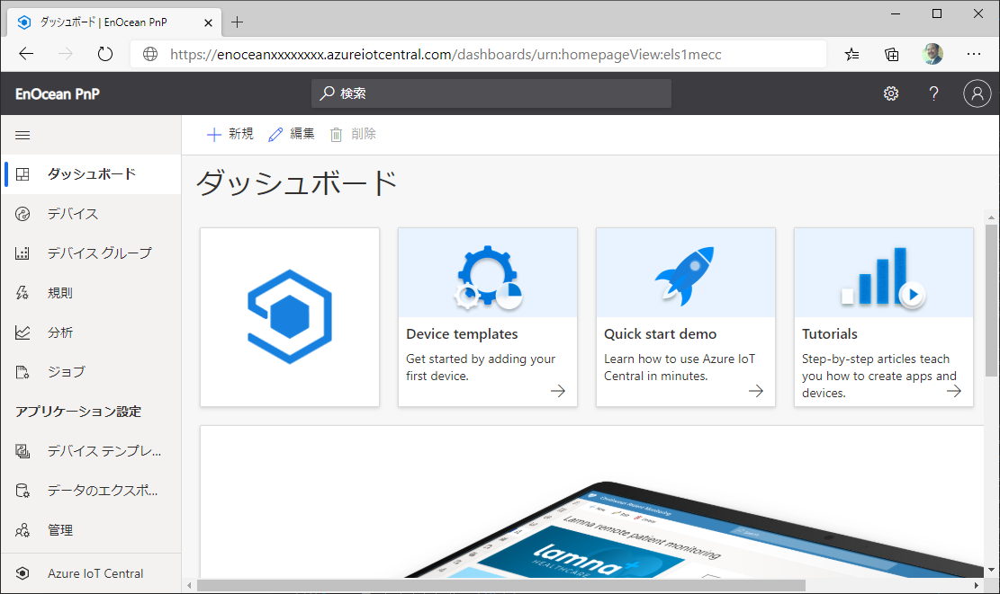
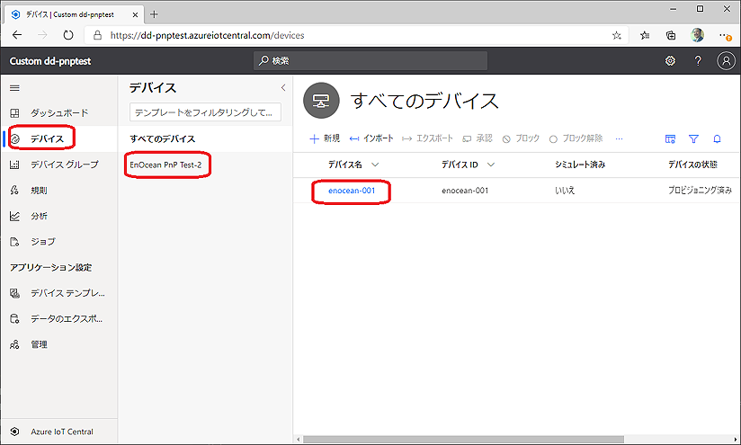
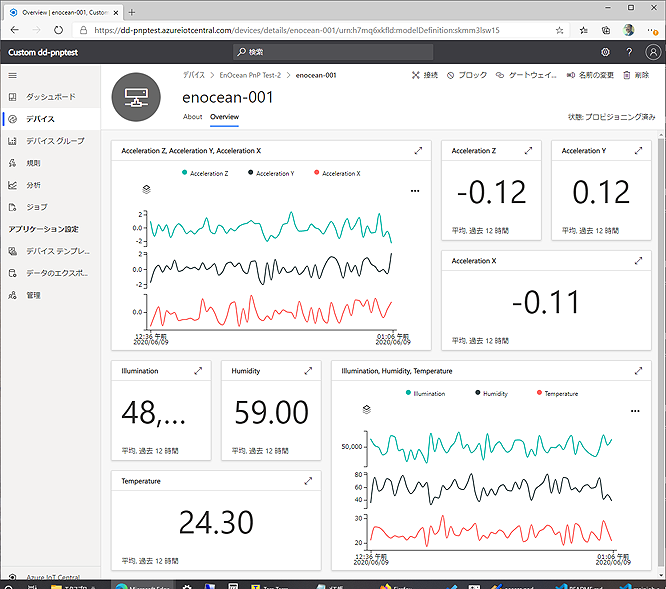

EnOceanSeminar2020
# デモ＆勝手ハンズオン 内容

https://ahidaka.github.io/EnOceanSeminar2020/

- EnOceanフィルター簡単プログラム
- Microsoft Azure IoT Plug and Play (Preview)

----
## EnOceanフィルター簡単プログラム

### 参考リポジトリ

https://github.com/ahidaka/EnOceanWindowsSamples

### 目的と概要

Visual Studioでコンパイルする簡単なC#プログラムを動作させて、EnOceanゲートウェイ開発に必要な次の基本的な機能を学習します。

- ESP3パケットの処理
- データテレグラムと Teach-In テレグラム
- テレグラムフィルター

### 必要機材

- Visual Studio

- USB400J または同等品

- 何らかのEnOcean センサーまたはスイッチ
(EEP A5-02-05 の温度センサーを推奨)


### 実習準備と手順

この演習では、前述の [EnOceanWindowsSamples](https://github.com/ahidaka/EnOceanWindowsSamples) リポジトリ内の 「[**SimpleSample**](https://github.com/ahidaka/EnOceanWindowsSamples/tree/master/SimpleSample)」 ソリューションを使用します。

別々にダウンロードするのは面倒なので、同じものをこのリポジトリ内に含めています。最初に [**SimpleSample**](/SimpleSample/) フォルダ内にある、
 [**EnOceanSample.sln**](/SimpleSample/EnOceanSample.sln) をVisual Studioで開き、ビルドしておきます。

#### プログラム起動

デバッグ実行を選択、または「▶」マーク、または「**F5**」キーを押して、プログラムをデバッグ実行すると、次の画面が開きます。右上から簡単に使い方を説明します。

- **Start** / **Stop**

    プログラムを開始または、一時停止します。

- **COM3**

    使用するCOMポートを確認または、設定します。自動認識して設定しますが、間違っている場合は変更できます。

- **Use Filter**

    プログラム開始時に指定したIDに対して、テレグラムフィルターを実行する場合にチェックします。

- [ID: 0401291D...]

    受信テレグラム表示ウィンドウです。データフィールド４バイトとともにテレグラムを表示します。

- **Temp ID**

    温度センサーの **ID** を設定します。その下の **SW ID** にはロッカースイッチの **ID** を設定します。

#### ID調査

まず **Start** ボタンをクリックしてプログラムを開始します。測定対象の温度センサーの **EnOcean ID** は次の手順でを調査します。

- テレグラム表示ウィンドウには、受信した全 EnOcean デバイスからのテレグラム・データが表示されます。

- 測定対象の温度センサーの **LEARN** ボタンを押して、**Teach-In** テレグラムを送出します。

- EnOceanSample 画面の右下に紺色白文字でプログラムが認識した Teach-In テレグラムの **EEP** と **ベンダーID** が表示されます。

- 同時にテレグラム表示ウィンドウに、通信データ４バイト目の **bit8** が立っている（この場合は **80**）データが表示されます。この **ID** が登録対象の温度センサーの **ID** です。


画面１　EnOceanSample ID調査

#### ID登録

前項で調査した **EnOcean ID** を、テレグラム表示ウィンドウからコピー＆ペーストして **Temp ID** に登録後、
**Start** ボタンを2回クリック（1回目：Stop, 2回目：Start）して、プログラムを再スタートします。この **EnOceanSample** プログラムは、このこのEEP A5-02-05 専用でデータ解析と変換表示する様に作られているため、これにより該当IDの温度データだけが正しく表示される様になります。（下図参照）


画面２　EnOceanSample ID登録

#### Filter 登録

前項のID登録では、UART から入って来る全てのEnOcean受信データに対して、登録したIDとの比較を常時行って、該当データを選択して処理を行っていました。しかしこの方法ではEnOcean デバイス 15台程度以上が常時送信する環境では、シリアルポート（コントローラー）のバッファーがオーバーフローして、データを取りこぼす場合があります。

対象IDをフィルター登録することで、この問題を回避することが可能です。フィルター登録機能は、すでに **EnOceanSample** プログラムに入っているため、「**Use Filter**」にチェック後、**Start** ボタンを2回クリックして、プログラムを再スタートすることで有効にできます。

下記画面の様に4行目以降に、指定ID以外のデータが表示されないことを確認してください。1～3行目には以前の記録されたIDが表示されますが、プログラムのバグなので無視して下さい。


画面３　EnOceanSample フィルター登録

#### プログラムの動きを追う

さらに時間に余裕がある方は、プログラムの動きを追ってみます。

Visual Stuidio で **MainWindow.xaml.cs** のソースコードを開いて、**338行目** にブレークポイントを設定します。ここは、シリアルポートから受信した **EnOcean ID** とデータ内容の解析を行っている部分です。ステップ実行することで、C# プログラムがテレグラムから温度データを解析する様子を追うことができます。

以上で、EnOceanフィルター簡単プログラムのデモと演習は終了です。重要なことは、このまま **USB400J** や同等品を継続して使用すると **EnOcean ID によるテレグラムフィルターが有効になったままで、登録外のデバイスからのデータを受信するｋとが出来ないため、必ず抜き差し等をして設定をリセットすることをお勧めします。


画面４　Visual Studio EnOceanSample のデバッグ 

<br/>

----
## Microsoft Azure IoT Plug and Play (Preview)

### 参考リポジトリ

https://github.com/ahidaka/EnOcean_IoTPnP

### 目的と概要

Microsoft Azure IoT Central / PnP (Preview) サービスと EnOcean マルチセンサーを事例にして、クラウドサービスと EnOcean システムの連携方法を理解します。

デモ＆実習では次の2種類の方法を用意しています。

1. シミュレーションプログラム

    実際のセンサーを使用せず、EnOcean のセンサーとゲートウェイをシミュレーションするプログラムを使用して、Azure IoT Central と IoT PnP を体験します。

2. EnOcean ゲートウェイ＋ブローカープログラム

    EnOceanゲートウェイプログラムとEnOcean センサー、 IoT PnP 対応のブローカープログラムを使用して、実際のセンサー情報をAzure IoT Central と IoT PnP で参照します。

### 必要機材

（実習に必須なもの、シミュレーター利用の場合）

- Linux PC(Ubuntu 18.04推奨), WSL, またはRaspberry Pi

- Node.js + npm 実行環境

- Microsoft Azure IoT Centralにアクセスするブラウザ環境

- Microsoft Azure IoT Centralアカウント（必須）

（以下はオプション、実機利用の場合）

- Linux PC(Ubuntu 18.04推奨、WSL1は動作しません), またはRaspberry Pi

- USB400J または同等品

- 何らかのEnOcean センサーまたはスイッチ
(EEP A5-02-05 の温度センサーを推奨)
<br/>

### 実習準備と手順（ 1. と 2. 共通）

#### Azure IoT Central アプリケーションの作成

[「Azure IoT Central アプリケーションの作成」](https://docs.microsoft.com/ja-jp/azure/iot-central/core/quick-deploy-iot-central) 手順に従って、「カスタム アプリ」 > 「カスタム アプリケーション」 テンプレートを使用して、中身が空のカスタム アプリケーションを作成します。

次の様な Azure IoT Central アプリケーション ダッシュボードが使えれば、OK です。


画面５　Microsoft Azure IoT Central アプリケーション ダッシュボード 

#### dps-keygen のインストール

- dps-keygen のインストール
    
    下記コマンドを実行して **dps-keygen** を利用可能にしてください。Node.js と npm を事前にインストールしておく必要があります。

    ```sh
    sudo npm i -g dps-keygen
    ```
 
- ■ アドバイス<br/>
    dps-keygen コマンドは実行して結果の文字列が得られれば良いため、必ずしも前記シミュレータープログラムと同じ環境にインストールする必要はありません。
    
    なお、既存の Linux環境への Node.js と npm のインストールは、インストール済の他のモジュールとのバージョン整合が取れないために、苦労する場合があります。

- リポジトリの入手とインストール<br/>
    前述の [EnOcean_IoTPnP](https://github.com/ahidaka/EnOcean_IoTPnP) リポジトリの今回の実習で使用するバイナリープログラムは、このリポジトリに含めています。**7月14日以前に EnOcean_IoTPnP リポジトリを入手した方は、バイナリーをこのセミナー用に更新しているため、このリポジトリに含まれるファイルを使用して下さい。**

#### デバイスキーの作成

[デバイス キーの生成](https://docs.microsoft.com/ja-jp/azure/iot-central/core/tutorial-connect-pnp-device#generate-device-key) 手順に従って、
前項で作成した「カスタム アプリケーション」の「管理」タブの「デバイス接続」ページで、
**このアプリの SAS トークン** の「キーの表示」をクリックして
「主キー」をコピーして保存します。

同じ **デバイス接続** 画面の **ID スコープ** は、後でアプリケーション起動時に使用するため、一時的にコピーして保存しておきます。

次に示すように dps-keygen コマンドを実行して生成・表示された デバイス キー をメモしておきます。
表示されたこの値は、後でアプリケーション起動時に使用します。

##### デバイス キーの生成 コマンド
```sh
dps-keygen -di:enocean-001 -mk:{上記で入手した「主キー」}
```

di:パラメータ で指定するデバイスID は、任意に設定可能です。今回の事例では、enocean-001 としています。このキー生成に使用したデバイス名も、後でアプリケーション起動時に使用するため、保存しておきます。

<br/>

### シミュレーター版の動作手順

ここからは、シミュレーター版プログラムを実行する手順の説明です。簡単なに実行できるため、実デバイスを持っている場合でも、先にシミュレーター プログラムで動作確認しておくことをお勧めします。

#### シミュレーターのインストール

以下の様に実行環境のアーキテクチャに応じたバイナリープログラムを、ダウンロードした **EnOcean_IoTPnP** リポジトリから、/usr/local/bin または Home ディレクトリ等の適当なディレクトリにコピーして下さい。コピーするだけでインストールは完了です。

- Raspberry pi シリーズ<br/>
 
    [simulatepnp/bin/armv7l/simulatepnp](simulatepnp/bin/armv7l/simulatepnp)

- Ubuntu 18.04 x86_64 PC または WSL<br/>

    [simulatepnp/bin/x86_64/simulatepnp](simulatepnp/bin/x86_64/simulatepnp)

#### シミュレーターの実行

実行は、次の通りコピーしたバイナリープログラムを Linux shell から起動するだけです。ビルドは必要ありません。実行後、画面にはたくさんのログメッセージが表示されます。

```sh
./simulatepnp [デバイス ID] [ID スコープ] [デバイス キー]
```

#### 実行例

```sh
./simulatepnp enocean-001 0ne0010FFFF 1rmxGaeTzBsCarlTaxyzOL9XXXXXXXXXXXXXXXXwOUg=
```

### シミュレーター版の動作検証

前項で作成したアプリケーションのデバイス画面を開きます。プログラムの実行後、Plug and Play 動作でテンプレートとデバイスが自動作成されるには、30秒程度の時間がかかるため、少し待ちます。やがて、下記画面例の様に「デバイス」>「すべてデバイス」に「EnOcean PnP Test-2」のテンプレート名が現れ、その下に前項のシミュレーター プログラム起動時に指定した「デバイス ID」（この例では enocean-001 ）が表示されます。

[](image/iotc-device.png)
画面６　すべてデバイスでの デバイス ID 表示

この画面で作成した「デバイスID」（この例では enocean-001 ）をクリックして「デバイス情報画面」を表示させます。さらに30秒程度待つと、自動的に生成されたグラムやデバイス情報画面での描画が始まります。

ソースコード（[simulatepnp/EnOceanPnPTest2_1yu_impl.c](simulatepnp/EnOceanPnPTest2_1yu_impl.c)）を見ると分かる通り、テレメトリーの値はシミュレーター プログラム用に、乱数で生成しています。テレメトリーの送信間隔は 2秒 に設定しています。

[](image/iotc-sim1.png)

画面７　シミュレーター動作画面例

#### 動作終了

起動した Linux Shell 画面で、「Control-C」 を入力してシミュレーター プログラムを終了します。

<br/>

### 実機版の動作手順

以降は、実際のEnOceanセンサーデバイスを使用して、Azure IoT Central にデータを転送する手順の説明です。

実機での動作は、EnOceanゲートウェイプログラムをインストールして設定、実行する以外は、前項 **シミュレーター版の動作手順** と同じです。また使用する IoT Central のアプリケーションや **デバイス ID**、**デバイス キー** も流用可能です。従って事前にトラブルを避けるためにも、前項の「シミュレーターでの動作」の項を一度実行して、試しておくことをお勧めします。


#### 機材の準備

STM550J と USB400J（または同等品）を用意してください。USB400J は動作環境マシンに装着します。はじめてEnOcean デバイスを使用する方は、Windows PC でEnOcean Dolphin View Advance ツールを使用して同様確認をしておくと良いでしょう。

- ■アドバイス<br/>
    EnOcean Dolphin View Advance アプリケーションは、EnOcean GmbH の [開発ツールダウンロードページ](https://www.enocean.com/en/support/download/) から入手します。

    最新版は以下の3.8.6.0 です。入手にはメールアドレスによるアカウント登録が必要です。
    https://www.enocean.com/en/support/download/dolphinview-advanced/DolphinViewAdvanced3_8_6_0.exe/

- ■参考<br/>
    EnOcean ゲートウェイ プログラム は以下の別リポジトリにあります。
    
    [EnOceanGateways リポジトリ](https://github.com/ahidaka/EnOceanGateways)


#### デバイスキーの作成

デバイスキーの生成手順は、前項のシミュレーターの手順と同じです。また、前項で作成した デバイス ID やデバイスキー をそのまま流用することも可能ですし、今回例えば デバイス ID を **enocean-002** 等として、新たに作成して使用することも可能です。

#### センサー登録と調査

今回のデモ＆実習で使用する Plug and Play プログラムは本来、EnOcean マルチセンサーを接続して動作させることを想定して作られたものです。しかしEnOcean マルチセンサーを入手することはまだ難しいため、他のセンサーで代替するための仕組みを組み込んでいます。

まず、動作環境にEnOcean ゲートウェイ プログラム (dpride:DolphinRide) の作業用ディレクトリ (/var/tmp/dprode) を、次の様に作成します。

```sh
mkdir /var/tmp/dpride
```

次に動作環境にインストールした EnOcean ゲートウェイ プログラム(dpride)を、次のオプションで「センサー登録モード」起動して、手持ちのEnOceanセンサーを動作環境に登録します。

```sh
sudo ./dpride -c -r -x
```

プログラムは USB400J または同等品が、/dev/ttyUSB0 または /dev/ttyS0 に接続していることを想定しているため、必要に応じて次の様に「-p PORT名」オプションで、接続ポートの変更を行って下さい。

- ポート指定の起動例

```sh
sudo ./dpride -c -r -x -p /dev/ttyUSB1
```

dprideの起動を確認した後、手持ちのEnOcean センサーの **LEARNボタン** を押してセンサーのEEPを環境に登録します。複数個登録しても構いません。

登録完了後は、「Control-C」で ゲートウェイ プログラムを一旦終了します。

デバイスを管理する、**/var/tmp/dpride/eofilter.txt** ファイルには、次の様にEnOceanデバイスの情報が登録されるので、確認して下さい。

```csv
0400200F,A5-04-01,Temperature and Humidity Sensor,HUM,TMP,TSN
0400070A,A5-02-05,Temperature Sensor Range 0°C to +40°C,TMP1
```

このファイルには次の形式でデバイス情報がCSV形式で保管されています。

```csv
EnOcean ID, EEP or GP, Device DEscription, Point ShortCut, Point ShortCut, ...
```

このうち HUM,TMP 等の Point ShortCut 名を後で使用します。ShortCut名は一般に、 HUM（湿度）, TMP（温度） 等、分かり易い名称と連番が割り当てられます。下記のEEPViewerでXMLファイルまたはPDFファイルを参照して詳しく確認することも可能です。

- Point Shortcut 名の確認（EEPViewer）

    [http://tools.enocean-alliance.org/EEPViewer/](http://tools.enocean-alliance.org/EEPViewer/)

#### センサー登録

動作環境にインストールした EnOcean ゲートウェイ プログラム(dpride)を、次のオプションで「センサー登録モード」起動して、マルチセンサーを動作環境に登録します。

```sh
sudo ./dpride -c -r
```

その後マルチセンサーの **LEARNボタン** を押して、デバイス登録を完了します。
起動画面にデバイス登録済のメッセージが出力されます。

#### プログラムの実行

先にPlug and Play 実行プログラムを起動します。

```sh
./enoceanpnp [デバイス ID] [ID スコープ] [デバイス キー] [TP=ShortCut] [HU=ShortCut]...
```

- 実行例

```sh
./enoceanpnp enocean-002 0ne0010FFFF 1rmxGaeTzBsCarlTaxyzOL9XXXXXXXXXXXXXXXXwOUg= TP=TMP1 HU=HUM
```

TP=TMP1 HU=HUM という記述はデータを読み出すShortCut名 の変更を指定します。enoceanpnp プログラムは元々、次のShortCut名を持つマルチセンサーだけを使用することを想定していました。今回の実習では、起動時のオプションとして同等機能を持つセンサーに割り当て変更して利用できる様に変更しています。元々のShortCut名は次の表で確認できます。

| 機能 | ShortCut | iothub name | 型 | 表示単位 | 最小 | 最大 | 備考 |
| :-: | :-: | :-: | :-: | :-: | :-: | :-: | :-: |
| 温度センサー | TP | temperature | double | ℃ | -40 | 60 |  |
| 湿度センサー | HU | humidity | double | % | 0 | 100 |  |
| 照度センサー | IL | illumination | double | lux | 0 | 100000 |  |
| 加速度センサー状態 | AS | accelerations | enum | - | 0 | 3 | Periodic Update(0), Threshold 1 exceeded(1), Threshold 2 exceeded(2) |
| 加速度センサー(X) | AX | accelerationx | double | g | -2.5 | 2.5 |  |
| 加速度センサー(Y) | AY | accelerationy | double | g | -2.5 | 2.5 |  |
| 加速度センサー(Z) | AZ | accelerationz | double | g | -2.5 | 2.5 |  |
| 開閉センサー | CO | contact | enum | - | 0 | 1 | Open(0), Close(1) |

<br/>

次に別の Shell画面を開いて、EnOcean ゲートウェイ プログラム (dpride) をオペレーション モードで起動します。各プログラムをバックグラウンドで実行することも可能ですが、それぞれ起動画面に動作状況ログを出力するのと、ともに「Control-C」で停止させることから、別画面で起動した方が使い勝手が良いです。

```sh
./dpride -o
```

#### 動作検証

動作検証も基本的には、前項のシミュレーターの場合と同じです。起動時に指定した デバイスID を指定して、IoT Central のデバイス情報表示画面で確認可能です。データ監視間隔の5秒間のタイムラグがありますが、加速度センサーや開閉センサーは、ほぼ即時にセンサーデータを送信するため、ほぼリアルタイムでの動作確認ができます。

#### 動作終了

dpride enoceanpnp ともに「Control-C」 を入力してシミュレーター プログラムを終了します。

以上

